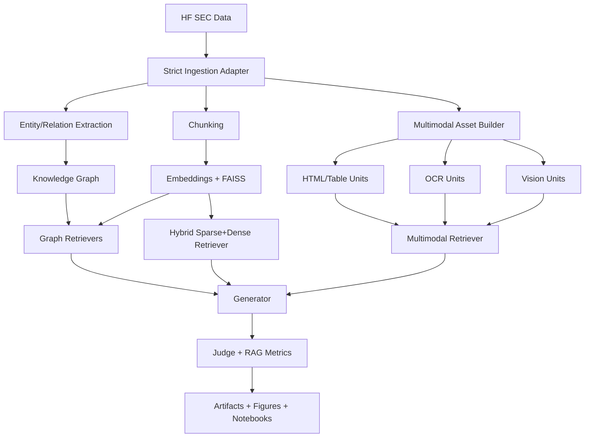

# Startup Intelligence GraphRAG Handbook

Version date: **June 22, 2026**  
Project root: `/home/ahmad/AI/startup-intelligence-graphrag`

This handbook documents the project from code and real artifacts only.
No synthetic results are introduced here.

## Table of Contents

1. [Project Snapshot](#project-snapshot)
2. [Exact Workflow (Code-Accurate)](#exact-workflow-code-accurate)
3. [Architecture](#architecture)
4. [Techniques and Tutorials](#techniques-and-tutorials)
5. [Real Run Results](#real-run-results)
6. [Artifacts and File Guide](#artifacts-and-file-guide)
7. [Notebook Guide](#notebook-guide)
8. [Known Gaps and Current Limits](#known-gaps-and-current-limits)
9. [README Quality References (Internet Research)](#readme-quality-references-internet-research)

## Project Snapshot

This repository implements a startup/company intelligence GraphRAG stack over SEC filings.

### Ground-truth execution state

- Core run summary exists and is populated:
  - `artifacts/run_summary.json`
- Strict dataset corpus manifest exists:
  - `artifacts/raw/manifest.json`
- Last strict host completion manifest is failed:
  - `artifacts/run_completion_manifest.json`
  - status: `failed`
  - failure message: `Stage 'core_pipeline' failed with exit code 1`

### Core run snapshot values (`artifacts/run_summary.json`)

- `dataset_repo`: `deerfieldgreen/stk-sec-filings`
- `n_filings`: `6`
- `n_chunks`: `1193`
- `n_eval_queries`: `1`
- `n_graph_nodes`: `178`
- `n_graph_edges`: `602`
- `n_ocr_units`: `2`
- `n_vision_units`: `2`
- `duration_seconds`: `1094.24`

## Exact Workflow (Code-Accurate)

This is the real orchestrated workflow from current code.

### A) Strict host orchestrator

Entrypoint: `scripts/run_complete_host.py`

Pipeline stages defined in code:
1. preflight checks
   - strict dataset policy + HF access
   - required Ollama model availability
   - adapter prerequisites (`unsloth`, `peft`, `trl`, CUDA)
2. core pipeline stage
   - invokes `scripts/run_full_real_project.py`
3. adapter stage
   - invokes `scripts/run_domain_adapter.py --mode execute --force --required`
4. notebook execution stage
   - invokes `scripts/execute_notebooks.py`
5. test stage
   - invokes `pytest -q`
6. post-check validation and final completion manifest write

### B) Core pipeline execution

Entrypoint: `scripts/run_full_real_project.py`

Processing order:
1. build filing corpus (`src/ingest.py`)
2. build evaluation queries (`src/eval_query_builder.py`)
3. chunk corpus (`src/chunking.py`)
4. embed + index chunks (`src/vectorstore.py`)
5. extract entities/relations (`src/extractor.py`)
6. build graph + communities (`src/graph.py`)
7. run retrieval/generation/judge/RAG metrics across techniques
8. build multimodal assets and multimodal techniques
9. write per-technique metrics and samples
10. generate figures and run summary artifacts

### C) Optional adapter execution

Entrypoint: `scripts/run_domain_adapter.py`

Modes:
- `placeholder`: seed adapter placeholder artifacts
- `execute`: run Unsloth+TRL training and PEFT evaluation if enabled/forced

## Architecture

## Techniques and Tutorials

Use these chapters as the zero-to-hero reading order.

1. [00_zero_to_hero_roadmap.md](tutorials/00_zero_to_hero_roadmap.md)
2. [01_core_graphrag_pipeline.md](tutorials/01_core_graphrag_pipeline.md)
3. [02_hybrid_rag_sparse_dense.md](tutorials/02_hybrid_rag_sparse_dense.md)
4. [03_agentic_rag_crag.md](tutorials/03_agentic_rag_crag.md)
5. [04_multimodal_rag.md](tutorials/04_multimodal_rag.md)
6. [05_optional_domain_adapter_unsloth_peft_trl.md](tutorials/05_optional_domain_adapter_unsloth_peft_trl.md)
7. [06_evaluation_results_and_interpretation.md](tutorials/06_evaluation_results_and_interpretation.md)

## Real Run Results

Source: `artifacts/run_summary.json`

### Retrieval metrics

| Technique | Precision@3 | Recall@3 | F1@3 | MRR | NDCG@3 |
|---|---:|---:|---:|---:|---:|
| vector_baseline | 0.0000 | 0.0000 | 0.0000 | 0.0000 | 0.0000 |
| graphrag_local | 0.3333 | 0.0256 | 0.0476 | 1.0000 | 0.4693 |
| graphrag_global | 0.0000 | 0.0000 | 0.0000 | 0.0000 | 0.0000 |
| graphrag_hybrid | 0.3333 | 0.0256 | 0.0476 | 0.3333 | 0.2346 |
| hybrid_sparse_dense | 0.0000 | 0.0000 | 0.0000 | 0.0000 | 0.0000 |
| agentic_crag | 0.3333 | 0.0256 | 0.0476 | 0.5000 | 0.2961 |
| multimodal_rag | 0.0000 | 0.0000 | 0.0000 | 0.0000 | 0.0000 |
| multimodal_ocr_rag | 0.0000 | 0.0000 | 0.0000 | 0.0000 | 0.0000 |
| multimodal_vision_rag | 0.0000 | 0.0000 | 0.0000 | 0.0000 | 0.0000 |
| multimodal_unified_v2 | 0.0000 | 0.0000 | 0.0000 | 0.0000 | 0.0000 |

### Generation metrics

| Technique | EM | BLEU | ROUGE-L | METEOR | BERTScore F1 |
|---|---:|---:|---:|---:|---:|
| vector_baseline | - | - | - | - | - |
| graphrag_local | - | - | - | - | - |
| graphrag_global | - | - | - | - | - |
| graphrag_hybrid | 0.0000 | 0.0136 | 0.1053 | 0.1303 | -0.0076 |
| hybrid_sparse_dense | 0.0000 | 0.0118 | 0.1000 | 0.0880 | 0.0446 |
| agentic_crag | 0.0000 | 0.0087 | 0.1207 | 0.1642 | 0.0312 |
| multimodal_rag | 0.0000 | 0.0054 | 0.0826 | 0.0763 | -0.0037 |
| multimodal_ocr_rag | 0.0000 | 0.0140 | 0.1176 | 0.1698 | -0.0092 |
| multimodal_vision_rag | 0.0000 | 0.0072 | 0.1053 | 0.0868 | -0.0078 |
| multimodal_unified_v2 | 0.0000 | 0.0127 | 0.0881 | 0.1033 | 0.0362 |

### RAG metrics

| Technique | Faithfulness | Context Precision | Context Recall | Answer Relevancy |
|---|---:|---:|---:|---:|
| vector_baseline | - | - | - | - |
| graphrag_local | - | - | - | - |
| graphrag_global | - | - | - | - |
| graphrag_hybrid | 0.9500 | 0.8500 | 0.9000 | 0.9200 |
| hybrid_sparse_dense | 0.0000 | 0.0000 | 0.0000 | 0.0000 |
| agentic_crag | 0.9500 | 1.0000 | 0.9000 | 1.0000 |
| multimodal_rag | 0.0000 | 0.0000 | 0.0000 | 0.0000 |
| multimodal_ocr_rag | 0.0000 | 0.0000 | 0.0000 | 0.0000 |
| multimodal_vision_rag | 0.0000 | 0.0000 | 0.0000 | 0.0000 |
| multimodal_unified_v2 | 0.0000 | 0.0000 | 0.0000 | 0.0000 |

## Artifacts and File Guide

### Run state

- `artifacts/run_summary.json`
- `artifacts/run_completion_manifest.json`
- `artifacts/raw/manifest.json`

### Per-technique outputs

- `artifacts/eval/*_full_metrics.json`
- `artifacts/retrievals/*_retrieval_samples_placeholder.json`
- `artifacts/generations/*_generation_samples_placeholder.json`

### Figures

- `artifacts/figures/retrieval_ndcg_comparison.png`
- `artifacts/figures/generation_rougel_comparison.png`
- `artifacts/figures/judge_overall_comparison.png`
- `artifacts/figures/graph_topology_snapshot.png`

## Notebook Guide

Source notebooks (tutorial-authoritative):
- `notebooks/startup_intelligence_graphrag_zero_to_hero.ipynb`
- `notebooks/02_hybrid_sparse_dense_rag_startup_intelligence.ipynb`
- `notebooks/03_multimodal_rag_startup_intelligence.ipynb`
- `notebooks/04_multimodal_rag_ocr_vision_startup_intelligence.ipynb`
- `notebooks/05_optional_domain_adapter_unsloth_peft_trl.ipynb`

Executed notebook artifacts:
- `notebooks/executed/*.ipynb`

## Known Gaps and Current Limits

- Current benchmark slice has `n_eval_queries=1`; this limits generalization strength.
- Adapter stage currently has placeholder result files in available artifacts.
- Latest strict host completion manifest is failed and should be rerun to completion in a future execution cycle.

## README Quality References (Internet Research)

The README structure and writing choices were aligned to current public guidance:

- GitHub Docs, About the repository README file:  
  https://docs.github.com/en/repositories/managing-your-repositorys-settings-and-features/customizing-your-repository/about-readmes
- GitHub Docs, Best practices for repositories:  
  https://docs.github.com/en/repositories/creating-and-managing-repositories/best-practices-for-repositories
- Open Source Guides, Starting an Open Source Project (README checklist prompts):  
  https://opensource.guide/starting-a-project/
- Google Style Guide, README files:  
  https://google.github.io/styleguide/docguide/READMEs.html
- Google Documentation Best Practices:  
  https://google.github.io/styleguide/docguide/best_practices.html
