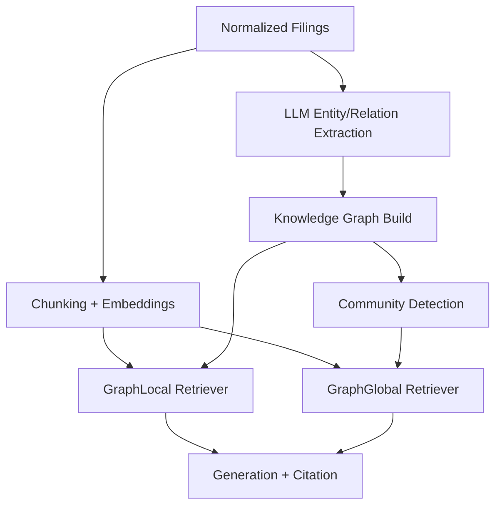

# Tutorial 01: Core GraphRAG Pipeline

## What is this technique?

GraphRAG augments standard vector retrieval with explicit graph structure built from entities, relationships, and document structure.

## Definition and core concepts

- Standard RAG: retrieve text chunks by vector similarity and generate answer.
- GraphRAG: add a graph layer with nodes (company, filing, section, entity) and edges (mentions, relations, co-occurrence), then use graph-aware retrieval.

## Why was this technique developed?

Traditional dense retrieval can miss structured relationships and multi-hop context.
GraphRAG improves retrieval for questions that need:
- section-level provenance
- entity neighborhood expansion
- cross-company thematic grouping

## What limitations of traditional RAG does it solve?

- Weak entity linkage between related passages
- Poor control over local vs global context scope
- Limited interpretability of why a chunk was selected

## Architecture and workflow diagram explanation

## Component-by-component breakdown

1. Ingestion and normalization
- `src/ingest.py`: strict data loading contract
- `src/ingest_deerfield.py`: deerfield schema adapter and filing construction

2. Chunking and embedding
- `src/chunking.py`: token-aware section chunking with overlap
- `src/vectorstore.py`: FAISS index and metadata sidecar

3. Extraction and graph build
- `src/extractor.py`: LLM extraction of entities and relationships
- `src/graph.py`: multi-layer graph construction, community detection, summaries

4. Graph-aware retrieval modes
- `src/retrievers.py`
  - `GraphLocalRetriever`: vector seeds + entity-hop expansion
  - `GraphGlobalRetriever`: query-to-community scoring over community summaries
  - `HybridRetriever`: combines local/global/vector channels

## Implementation details and design decisions in this project

- Strict source policy: no fallback dataset when strict mode is enabled.
- Graph is additive: vector retrieval remains available as baseline.
- Community summaries use a deterministic fast path in full-run script for run stability:
  - `scripts/run_full_real_project.py::_build_fast_community_summaries`

## When should it be used in real systems?

Use GraphRAG when:
- queries reference entities/relationships, not only lexical semantics
- section lineage and cross-document structure matter
- you need controllable local/global retrieval behavior

## Advantages and disadvantages

Advantages:
- better structural grounding for company intelligence questions
- retrieval explanation via graph provenance
- supports local and global search modes

Disadvantages:
- higher pipeline complexity than plain vector RAG
- extraction quality can bottleneck graph quality
- community-level retrieval can drift if query set is too small

## Comparison against standard RAG and other variants

- vs vector-only RAG: stronger structure, more moving parts.
- vs hybrid sparse+dense: GraphRAG adds topology, not just lexical channel fusion.
- vs agentic CRAG: GraphRAG is retrieval substrate; CRAG adds control-loop routing.

## Real run observations from this repository

Source of truth: `artifacts/run_summary.json`

- `graphrag_local` outperformed vector baseline on retrieval (`NDCG@3 = 0.4693`).
- `graphrag_global` returned zero on this run’s query set, indicating mismatch between global community evidence and the local company-targeted query.
- `graphrag_hybrid` retained non-zero retrieval plus strong RAG quality (`faithfulness=0.95`, `answer_relevancy=0.92`).

Interpretation:
- The available evaluated query was local-company focused; local graph expansion aligned better than global thematic retrieval.
- For robust global behavior claims, more global-labeled queries are needed in the executed benchmark.
