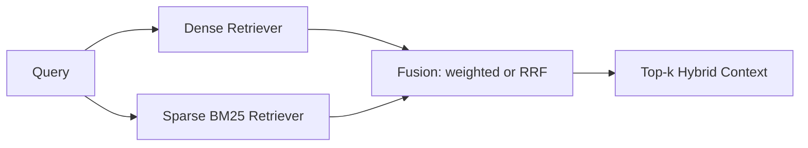

# Tutorial 02: Hybrid RAG (Sparse + Dense)

## What is this technique?

Hybrid RAG combines dense semantic retrieval with sparse lexical retrieval (BM25), then fuses rankings.

## Definition and core concepts

- Dense channel: embeddings + vector similarity.
- Sparse channel: token-level lexical ranking (BM25).
- Fusion: weighted score fusion or reciprocal rank fusion (RRF).

## Why was this technique developed?

Dense embeddings are strong semantically, but can miss exact lexical anchors such as tickers, section terminology, and filing-specific risk phrasing.
Sparse retrieval helps recover those exact-signal passages.

## What limitations of traditional RAG does it solve?

- misses exact keywords/tickers under embedding-only retrieval
- unstable retrieval for rare domain terms

## Architecture and workflow diagram explanation

## Component-by-component breakdown

- Sparse retrieval module:
  - `src/extensions/sparse.py`
  - `SparseBM25Retriever`
- Hybrid fusion module:
  - `src/extensions/hybrid_sparse_dense.py`
  - `HybridSparseDenseRetriever`
  - fusion modes: `weighted`, `rrf`
- End-to-end benchmarking harness:
  - `src/extensions/benchmark.py`
  - used by `scripts/run_full_real_project.py`

## Implementation details and design decisions in this project

- BM25 uses existing chunk metadata from FAISS sidecar, so no separate corpus duplication.
- Domain-aware sparse boosts are applied for risk/market cues (`src/extensions/sparse.py`).
- Weighted fusion defaults: dense 0.55, sparse 0.45.

## When should it be used in real systems?

Use hybrid retrieval when:
- business vocabulary has exact lexical anchors
- users ask ticker/product/section-specific questions
- you need improved recall before reranking/generation

## Advantages and disadvantages

Advantages:
- better resilience to lexical edge cases
- minimal integration overhead over existing vector stack

Disadvantages:
- requires tuning fusion weights per domain
- can still fail if both channels retrieve off-target contexts

## Comparison against standard RAG and other variants

- vs vector-only: adds lexical recall channel.
- vs GraphRAG: no topology; only retrieval signal fusion.
- vs agentic CRAG: no dynamic routing, static retrieval strategy.

## Real run observations from this repository

Source of truth: `artifacts/run_summary.json`

- `hybrid_sparse_dense` retrieval was zero for the run query.
- Generation metrics were non-zero but low (`ROUGE-L=0.1000`, `METEOR=0.0880`).
- RAG quality and judge outputs were poor (`faithfulness=0.0`, overall judge score near minimum in full-metric row).

Interpretation:
- Sparse+dense fusion alone did not recover the relevant ES business passages in this specific run.
- This is exactly where graph-aware or corrective routing strategies become valuable.
