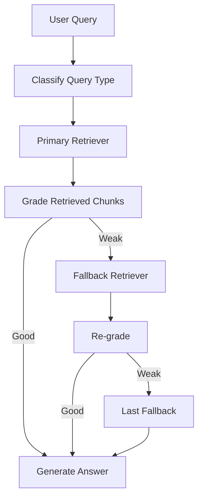

# Tutorial 03: Agentic RAG with Corrective Routing (CRAG-style)

## What is this technique?

Agentic RAG adds a control loop around retrieval and generation.
It classifies query type, routes to retrievers, grades retrieved chunks, and retries with alternate retrievers when quality is low.

## Definition and core concepts

- Query classification: local/global/factual.
- Tool routing: choose retrieval strategy by query type.
- Corrective grading: LLM grades chunk relevance.
- Branching/retry: if relevance is weak, switch retriever and retry.

## Why was this technique developed?

Single-shot retrieval can fail silently.
CRAG-style loops add a quality gate before answer generation.

## What limitations of traditional RAG does it solve?

- one-shot retrieval brittleness
- no internal retrieval quality control
- weak adaptation to query type

## Architecture and workflow diagram explanation

## Component-by-component breakdown

- Agent orchestration and state trace:
  - `src/agent.py`
  - `AgenticGraphRAG`, `AgentResult`, `AgentTraceStep`
- Retrieval substrate supplied to agent:
  - `src/retrievers.py`
- End-to-end agentic evaluation:
  - `scripts/run_full_real_project.py::evaluate_agentic_end_to_end`

## Implementation details and design decisions in this project

- Query classifier prompt and doc-grading prompt are explicit JSON contracts.
- Fallback heuristic keeps top chunks if grader returns no relevant IDs.
- Max corrective iterations are bounded for latency control.

## When should it be used in real systems?

Use agentic corrective retrieval when:
- precision failures are costly
- you need adaptive retrieval per query intent
- latency budget can tolerate iterative retrieval

## Advantages and disadvantages

Advantages:
- improves answer grounding under retrieval uncertainty
- explicit trace of decisions for debugging

Disadvantages:
- higher latency than static pipelines
- adds LLM-decision failure modes (misclassification/grading drift)

## Comparison against standard RAG and other variants

- vs standard RAG: adds control loop and retries.
- vs GraphRAG-only: adds dynamic routing and quality gating.
- vs hybrid sparse+dense-only: can switch strategies when one fails.

## Real run observations from this repository

Source of truth: `artifacts/run_summary.json`, `artifacts/eval/agentic_crag_full_metrics.json`

- Retrieval: non-zero (`Precision@3=0.3333`, `NDCG@3=0.2961`).
- Generation: strongest ROUGE-L among compared techniques in this run (`0.1207`).
- RAG metrics: high (`faithfulness=0.95`, `context_precision=1.0`, `answer_relevancy=1.0`).
- Judge row: high overall score (`4.8/5`).

Interpretation:
- Corrective routing helped recover relevant ES business evidence after retrieval uncertainty.
- In this run profile, agentic behavior produced the best end-to-end grounded response quality.
