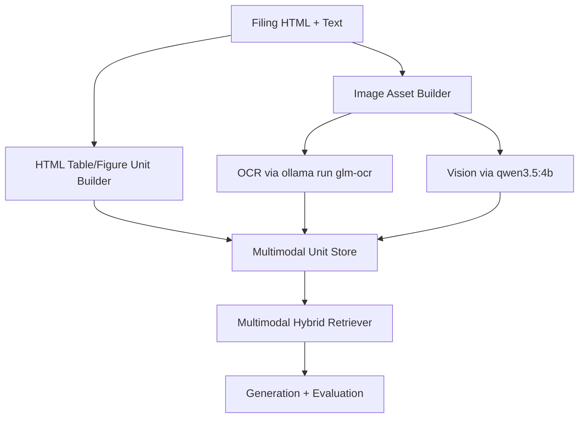

# Tutorial 04: Multimodal RAG (HTML, OCR, Vision)

## What is this technique?

Multimodal RAG extends text retrieval with filing-derived visual/structured channels:
- table/figure text from filing HTML
- OCR text from generated filing visuals
- vision summaries from image analysis

## Definition and core concepts

- Multimodal units: normalized retrievable records tagged by modality.
- Multimodal retriever: dense+sparse fusion over multimodal units with modality weights.
- Unified v2: optional channel composition (HTML + OCR + vision).

## Why was this technique developed?

Important filing signal appears in tables/charts/visual structure, not only plain paragraph text.
Multimodal channels can capture numeric and layout-linked evidence.

## What limitations of traditional RAG does it solve?

- text-only retrieval misses visual/tabular cues
- weak support for chart/table derived evidence

## Architecture and workflow diagram explanation

## Component-by-component breakdown

- HTML multimodal extraction:
  - `src/extensions/multimodal.py`
- OCR channel (`glm-ocr`):
  - `src/extensions/multimodal_ocr.py`
- Vision channel (`qwen3.5:4b`):
  - `src/extensions/multimodal_vision.py`
- Unified channel composition:
  - `src/extensions/multimodal_v2.py`
- Retrieval over multimodal units:
  - `src/extensions/multimodal_retriever.py`
- Visual asset preparation (tables/text snapshots):
  - `src/multimodal_assets.py`

## Implementation details and design decisions in this project

- OCR call path uses direct local command: `ollama run glm-ocr`.
- Vision path uses Ollama chat image input with strict JSON prompt contract.
- Multimodal retriever applies modality weighting to fused dense+sparse scores.
- Text-snapshot image fallback ensures OCR/vision stages still execute when table extraction is unavailable.

## When should it be used in real systems?

Use multimodal RAG when:
- numerical or diagram context materially affects answer quality
- filing tables/charts are central evidence
- your use case needs extraction from visual channels

## Advantages and disadvantages

Advantages:
- can ingest evidence beyond pure text
- supports richer context for numeric/risk signals

Disadvantages:
- extra latency and model dependencies
- more brittle if visual channels are sparse or off-topic
- requires careful relevance gating when query is text-local

## Comparison against standard RAG and other variants

- vs standard RAG: broader evidence channels.
- vs hybrid sparse+dense: modality expansion, not just scoring fusion.
- vs agentic CRAG: multimodal is data-channel expansion; CRAG is control policy.

## Real run observations from this repository

Source of truth: `artifacts/run_summary.json`

- Multimodal unit counts: `n_ocr_units=2`, `n_vision_units=2` in executed run summary.
- Retrieval for multimodal techniques was zero on the evaluated query.
- Generation metrics were non-zero but not competitive with agentic/graphrag hybrid in this run.

Interpretation:
- The evaluated query targeted ES business narrative, while retrieved multimodal units were from other filings/channels.
- This run demonstrates technical integration correctness, but not a quality lift for this specific benchmark slice.
- For fair multimodal benefit assessment, add query sets that explicitly target visual/tabular evidence.
