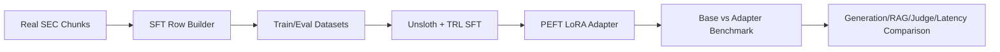

# Tutorial 05: Optional Domain Adapter (Unsloth + PEFT + TRL)

## What is this technique?

A separate, optional generator adaptation stage that fine-tunes a LoRA adapter on real SEC chunk continuations.

## Definition and core concepts

- Unsloth: optimized loading/training utilities for efficient LLM fine-tuning.
- PEFT: parameter-efficient fine-tuning (LoRA adapters).
- TRL: trainer stack (SFTTrainer/SFTConfig) for supervised fine-tuning workflows.

## Why was this technique developed?

Base generator models may be insufficiently adapted to SEC-style language and domain phrasing.
Adapter tuning can improve style alignment and domain continuity with less compute than full fine-tuning.

## What limitations of traditional RAG does it solve?

- weak in-domain generation style consistency
- lower domain faithfulness when context is noisy

Important: this stage does **not** replace retrieval quality requirements. It only adapts generation behavior.

## Architecture and workflow diagram explanation

## Component-by-component breakdown

- Core module:
  - `src/extensions/domain_adapter.py`
- CLI entrypoint:
  - `scripts/run_domain_adapter.py`
- Host orchestration integration:
  - `scripts/run_complete_host.py` (adapter stage required there)

## Implementation details and design decisions in this project

- Adapter stage is isolated and opt-in by default (`SIRAG_ADAPTER_ENABLE=false` unless overridden).
- Data source for SFT rows is real project chunk output, not synthetic text.
- CUDA preflight + dependency checks are explicit.
- Tool usage is scoped:
  - Unsloth/PEFT/TRL used only in this stage.
  - Not used in retrieval, graph, CRAG routing, OCR, or multimodal indexing.

## Where each library is used in code

- Unsloth:
  - `FastLanguageModel.from_pretrained`
  - `FastLanguageModel.get_peft_model`
- TRL:
  - `SFTConfig`, `SFTTrainer`
- PEFT:
  - `PeftModel.from_pretrained`
  - optional `merge_and_unload`

(All in `src/extensions/domain_adapter.py`)

## When should it be used in real systems?

Use this stage when:
- you already have stable retrieval and want generator domain adaptation
- GPU and fine-tuning dependencies are available
- incremental quality lift justifies training complexity

## Advantages and disadvantages

Advantages:
- efficient adaptation vs full model training
- clear isolation from core retrieval stack

Disadvantages:
- adds operational complexity and GPU dependency
- does not solve retrieval failures by itself

## Comparison against standard RAG and other variants

- vs standard RAG: modifies generator behavior, not retrieval substrate.
- vs GraphRAG/hybrid/CRAG: complementary layer; different problem scope.

## Real run observations from this repository

Current artifact state:
- `artifacts/run_summary_domain_adapter_placeholder.json` indicates adapter stage not executed in completed mode.
- comparison placeholders exist under `artifacts/eval/domain_adapter_*_placeholder.json`.
- strict host run manifest currently failed before completed end-state.

Interpretation:
- Adapter implementation is present and wired, but repository artifacts currently do not show completed adapter benchmark outputs.
- Performance/quality impact claims for adapter stage should only be made after a successful execute-mode adapter run.
